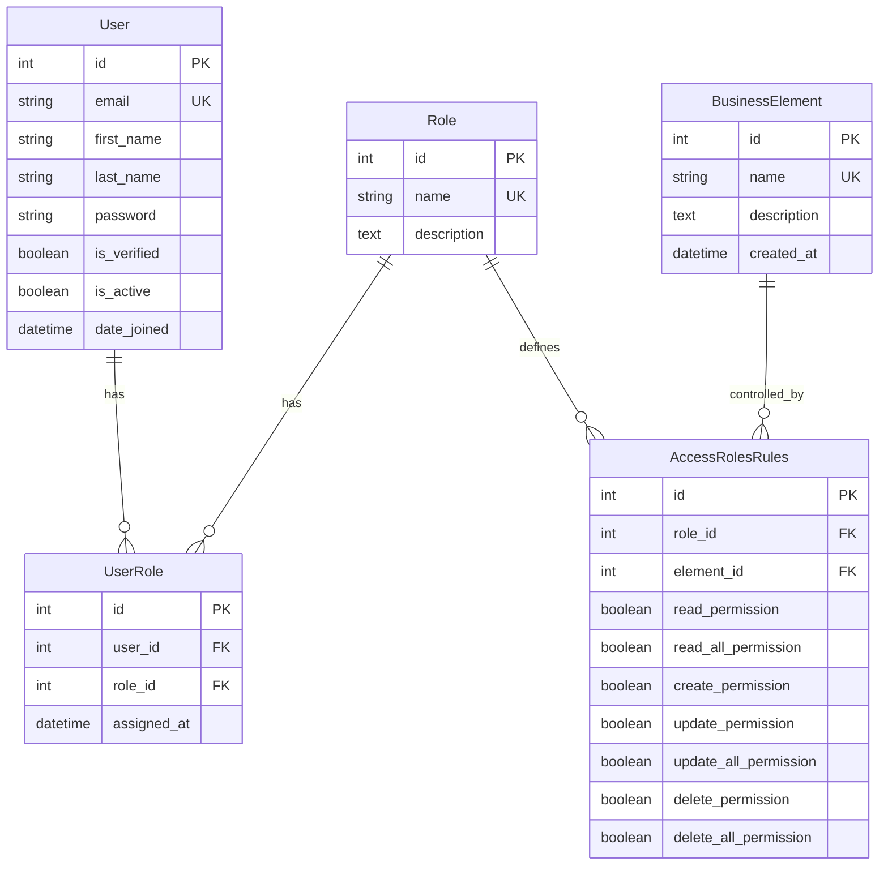

# 🔐 Access Control System - Система Аутентификации и Авторизации

Полнофункциональная система управления доступом с Role-Based Access Control (RBAC), реализованная на Django REST Framework.

## 📋 Содержание

- [Описание проекта](#описание-проекта)
- [Ключевые концепции](#ключевые-концепции)
- [Архитектура системы](#архитектура-системы)
- [Установка и запуск](#установка-и-запуск)
- [Структура базы данных](#структура-базы-данных)
- [Система разграничения прав](#система-разграничения-прав)
- [API Endpoints](#api-endpoints)
- [Тестирование](#тестирование)
- [Примеры использования](#примеры-использования)

---

# 🎯 Описание проекта

Данный проект представляет собой backend-приложение для управления аутентификацией и авторизацией пользователей с гибкой системой ролей и прав доступа.

### Основной функционал:

✅ **Аутентификация пользователей**
- Регистрация с верификацией email через OTP
- Вход в систему с JWT токенами
- Выход из системы
- Обновление профиля
- Мягкое удаление аккаунта

✅ **Авторизация и управление доступом**
- Role-Based Access Control (RBAC)
- Гибкая система прав (read, create, update, delete)
- Разделение прав на "свои объекты" и "все объекты"
- API для администрирования ролей и прав

✅ **Mock бизнес-объекты**
- Товары (products)
- Заказы (orders)
- Магазины (stores)

---

## 🧠 Ключевые концепции

### Аутентификация vs Авторизация

**Аутентификация** (Authentication) - это процесс проверки личности пользователя.
- *Вопрос:* "Кто ты?"
- *Реализация:* Login/Logout, JWT токены, OTP верификация
- *Пример:* Пользователь вводит email и пароль → система проверяет данные → выдает JWT токен

**Авторизация** (Authorization) - это процесс проверки прав доступа пользователя.
- *Вопрос:* "Что тебе разрешено делать?"
- *Реализация:* RBAC система с ролями и правилами
- *Пример:* Пользователь с ролью "manager" может редактировать товары, но не может удалять пользователей

### JWT токены

**JSON Web Token (JWT)** - это компактный способ безопасной передачи информации между клиентом и сервером.

**Структура JWT:**
```
header.payload.signature
```

**Пример токена:**
```
eyJhbGciOiJIUzI1NiIsInR5cCI6IkpXVCJ9.eyJ1c2VyX2lkIjoxLCJlbWFpbCI6ImFkbWluQGV4YW1wbGUuY29tIn0.signature
```

**Payload содержит:**
```json
{
  "user_id": 1,
  "email": "admin@example.com"
}
```

**Как работает:**
1. Пользователь логинится → сервер создает JWT и отправляет клиенту
2. Клиент сохраняет токен и отправляет его в заголовке `Authorization: Bearer <token>`
3. `JWTAuthenticationMiddleware` парсит токен и устанавливает `request.user`
4. Защищенные endpoints проверяют права через `request.user`

**Преимущества JWT над сессиями:**
- ✅ Stateless - сервер не хранит сессии
- ✅ Масштабируемость - легко работает на нескольких серверах
- ✅ Безопасность - подписан криптографически
- ✅ Мобильные приложения - легко интегрируется с React Native, Flutter

---

## 🏗️ Архитектура системы

### Технологический стек

- **Backend:** Django 5.0.1, Django REST Framework 3.14
- **База данных:** SQLite (dev), PostgreSQL (production ready)
- **Аутентификация:** JWT (PyJWT 2.8.0)
- **Хеширование паролей:** bcrypt 4.1.2
- **API документация:** drf-spectacular (Swagger/ReDoc)
- **Тестирование:** pytest, pytest-django
- **Админка:** django-jazzmin

### Структура проекта

```
C26_AccessControlSystem_26_project/
├── apps/
│   ├── users/              # Модуль пользователей и аутентификации
│   │   ├── models.py       # User, Role, UserRole
│   │   ├── serializers.py  # Сериализаторы для API
│   │   ├── views.py        # Endpoints аутентификации
│   │   ├── permissions.py  # Кастомные права доступа
│   │   └── tests/          # Тесты аутентификации
│   │
│   ├── access/             # Модуль управления доступом
│   │   ├── models.py       # BusinessElement, AccessRolesRules
│   │   ├── serializers.py  # Сериализаторы для управления правами
│   │   ├── views.py        # API для администрирования
│   │   └── tests/          # Тесты RBAC
│   │
│   ├── business/           # Mock бизнес-объекты
│   │   ├── mock_views.py   # Products, Orders, Stores endpoints
│   │   └── urls.py
│   │
│   └── core/
│       └── middleware.py   # JWTAuthenticationMiddleware
│
├── config/
│   ├── settings/
│   │   ├── base.py         # Базовые настройки
│   │   ├── development.py  # Development окружение
│   │   ├── production.py   # Production настройки
│   │   └── testing.py      # Настройки для тестов
│   ├── urls.py
│   └── wsgi.py
│
├── fixtures/
│   └── initial_data.json   # Начальные данные (роли, права)
│
├── manage.py
├── requirements.txt
├── pytest.ini
├── Dockerfile
├── docker-compose.yml
├── Makefile
└── README.md
```

---

## 🚀 Установка и запуск

### Метод 1: Автоматическая установка (рекомендуется)

```bash
# Клонировать репозиторий
git clone https://github.com/Islam0122/99_pet_projects_backend
cd C26_AccessControlSystem_26_project

# Сделать setup.sh исполняемым и запустить
chmod +x setup.sh
./setup.sh

# Запустить сервер
python manage.py runserver
```

### Метод 2: Ручная установка

```bash
# Создать виртуальное окружение
python3 -m venv venv
source venv/bin/activate  # Linux/Mac
# или
venv\Scripts\activate     # Windows

# Установить зависимости
pip install -r requirements.txt

# Создать .env файл
cp .env.example .env
# Отредактировать .env с вашими настройками

# Выполнить миграции
python manage.py makemigrations
python manage.py migrate

# Загрузить начальные данные
python manage.py loaddata fixtures/initial_data.json

# Создать тестовых пользователей
python manage.py create_test_users

# Собрать статику
python manage.py collectstatic --noinput

# Запустить сервер
python manage.py runserver
```

### Метод 3: Docker

```bash
# Сборка и запуск
make docker-build
make docker-up

# Остановка
make docker-down

# Логи
make docker-logs
```

### Доступные команды (Makefile)

```bash
make help           # Показать все команды
make install        # Установить зависимости
make migrate        # Выполнить миграции
make fixtures       # Загрузить тестовые данные
make users          # Создать тестовых пользователей
make setup          # Полная настройка проекта
make run            # Запустить dev сервер
make test           # Запустить тесты
make clean          # Очистить временные файлы
make superuser      # Создать суперпользователя
make shell          # Открыть Django shell
```

### Переменные окружения (.env)

```env
SECRET_KEY=
DEBUG=True
DJANGO_ENV=development

# Email настройки для OTP
EMAIL_HOST_USER=your-email@gmail.com
EMAIL_HOST_PASSWORD=your-app-password
```

---

## 🗄️ Структура базы данных

### Диаграмма ER



### Описание таблиц

#### 1. **users.User** - Пользователи системы

| Поле | Тип | Описание |
|------|-----|----------|
| id | Integer | Primary Key |
| email | String(255) | Email (уникальный) |
| first_name | String(50) | Имя |
| last_name | String(50) | Фамилия |
| password | String | Хешированный пароль (bcrypt) |
| is_verified | Boolean | Подтвержден ли email |
| is_active | Boolean | Активен ли аккаунт |
| is_staff | Boolean | Доступ в админку |
| date_joined | DateTime | Дата регистрации |
| otp_code | String(6) | OTP код для верификации |
| otp_expires_at | DateTime | Срок действия OTP |

#### 2. **users.Role** - Роли в системе

| Поле | Тип | Описание |
|------|-----|----------|
| id | Integer | Primary Key |
| name | String(50) | Название роли (уникальное) |
| description | Text | Описание роли |

**Предустановленные роли:**
- `admin` - Полный доступ ко всем ресурсам
- `manager` - Управление товарами, заказами
- `user` - Обычный пользователь
- `guest` - Только чтение публичных данных

#### 3. **users.UserRole** - Связь пользователей и ролей

| Поле | Тип | Описание |
|------|-----|----------|
| id | Integer | Primary Key |
| user_id | Foreign Key | Ссылка на User |
| role_id | Foreign Key | Ссылка на Role |
| assigned_at | DateTime | Когда назначена роль |

*Constraint:* unique_together (user_id, role_id)

#### 4. **access.BusinessElement** - Бизнес-объекты системы

| Поле | Тип | Описание |
|------|-----|----------|
| id | Integer | Primary Key |
| name | String(100) | Название элемента (уникальное) |
| description | Text | Описание |
| created_at | DateTime | Дата создания |

**Предустановленные элементы:**
- `users` - Управление пользователями
- `products` - Товары
- `orders` - Заказы
- `stores` - Магазины
- `access_rules` - Правила доступа

#### 5. **access.AccessRolesRules** - Правила доступа

| Поле | Тип | Описание |
|------|-----|----------|
| id | Integer | Primary Key |
| role_id | Foreign Key | Ссылка на Role |
| element_id | Foreign Key | Ссылка на BusinessElement |
| read_permission | Boolean | Чтение своих объектов |
| read_all_permission | Boolean | Чтение всех объектов |
| create_permission | Boolean | Создание объектов |
| update_permission | Boolean | Обновление своих объектов |
| update_all_permission | Boolean | Обновление всех объектов |
| delete_permission | Boolean | Удаление своих объектов |
| delete_all_permission | Boolean | Удаление всех объектов |
| created_at | DateTime | Дата создания правила |
| updated_at | DateTime | Дата обновления правила |

*Constraint:* unique_together (role_id, element_id)

---

## 🔐 Система разграничения прав

### Концепция RBAC

**Role-Based Access Control** - модель управления доступом, где права назначаются ролям, а роли — пользователям.

### Матрица прав

| Право | Описание | Пример |
|-------|----------|--------|
| `read_permission` | Чтение объектов, созданных самим пользователем | User видит только свои заказы |
| `read_all_permission` | Чтение всех объектов в системе | Manager видит все заказы |
| `create_permission` | Создание новых объектов | User может создавать заказы |
| `update_permission` | Обновление своих объектов | User может редактировать свои заказы |
| `update_all_permission` | Обновление любых объектов | Manager может редактировать любые заказы |
| `delete_permission` | Удаление своих объектов | User может удалять свои заказы |
| `delete_all_permission` | Удаление любых объектов | Admin может удалять любые заказы |

### Логика проверки прав

```python
# Псевдокод проверки доступа
if action == "read":
    if user has read_all_permission:
        return ALL objects
    elif user has read_permission:
        return objects WHERE owner_id == user.id
    else:
        return 403 Forbidden

if action == "update":
    if user has update_all_permission:
        return allow
    elif user has update_permission AND object.owner_id == user.id:
        return allow
    else:
        return 403 Forbidden
```

### Права по ролям

#### 👑 Admin (Администратор)

| Элемент | Права |
|---------|-------|
| users | Полный доступ (CRUD all) |
| products | Полный доступ (CRUD all) |
| orders | Полный доступ (CRUD all) |
| stores | Полный доступ (CRUD all) |
| access_rules | Полный доступ (CRUD all) |

#### 👔 Manager (Менеджер)

| Элемент | Права |
|---------|-------|
| users | Чтение всех (read_all) |
| products | Полный CRUD, кроме удаления чужих |
| orders | Чтение всех, обновление всех, без создания/удаления |
| stores | CRUD, кроме удаления |
| access_rules | Нет доступа |

#### 👤 User (Пользователь)

| Элемент | Права |
|---------|-------|
| users | Нет доступа |
| products | Только чтение всех |
| orders | CRUD только своих заказов |
| stores | Только чтение всех |
| access_rules | Нет доступа |

#### 👁️ Guest (Гость)

| Элемент | Права |
|---------|-------|
| users | Нет доступа |
| products | Только чтение всех |
| orders | Нет доступа |
| stores | Только чтение всех |
| access_rules | Нет доступа |

---

## 📡 API Endpoints

### Аутентификация

| Метод | Endpoint | Описание | Auth |
|-------|----------|----------|------|
| POST | `/api/register/` | Регистрация нового пользователя | - |
| POST | `/api/verify-otp/` | Подтверждение email через OTP | - |
| POST | `/api/login/` | Вход в систему | - |
| POST | `/api/logout/` | Выход из системы | JWT |
| GET | `/api/profile/` | Получить профиль | JWT |
| PATCH | `/api/profile/update/` | Обновить профиль | JWT |
| DELETE | `/api/profile/delete/` | Мягкое удаление аккаунта | JWT |
| GET | `/api/protected/` | Тестовый защищенный endpoint | JWT |

### Управление ролями (только Admin)

| Метод | Endpoint | Описание | Auth |
|-------|----------|----------|------|
| GET | `/api/admin/roles/` | Список всех ролей | Admin |
| POST | `/api/admin/roles/` | Создать роль | Admin |
| GET | `/api/admin/roles/{id}/` | Детали роли | Admin |
| PATCH | `/api/admin/roles/{id}/` | Обновить роль | Admin |
| DELETE | `/api/admin/roles/{id}/` | Удалить роль | Admin |
| GET | `/api/admin/roles/{id}/users/` | Пользователи с этой ролью | Admin |
| POST | `/api/admin/assign-role/` | Назначить роль пользователю | Admin |
| POST | `/api/admin/revoke-role/` | Отозвать роль у пользователя | Admin |

### Бизнес-элементы (только Admin)

| Метод | Endpoint | Описание | Auth |
|-------|----------|----------|------|
| GET | `/api/admin/business-elements/` | Список элементов | Admin |
| POST | `/api/admin/business-elements/` | Создать элемент | Admin |
| GET | `/api/admin/business-elements/{id}/` | Детали элемента | Admin |
| PATCH | `/api/admin/business-elements/{id}/` | Обновить элемент | Admin |
| DELETE | `/api/admin/business-elements/{id}/` | Удалить элемент | Admin |

### Правила доступа (только Admin)

| Метод | Endpoint | Описание | Auth |
|-------|----------|----------|------|
| GET | `/api/admin/access-rules/` | Список всех правил | Admin |
| POST | `/api/admin/access-rules/` | Создать правило | Admin |
| GET | `/api/admin/access-rules/{id}/` | Детали правила | Admin |
| PATCH | `/api/admin/access-rules/{id}/` | Обновить правило | Admin |
| DELETE | `/api/admin/access-rules/{id}/` | Удалить правило | Admin |
| GET | `/api/admin/access-rules/by_role/?role_name=admin` | Правила для роли | Admin |
| GET | `/api/admin/my-permissions/` | Мои права доступа | JWT |

### Mock бизнес-объекты

| Метод | Endpoint | Описание | Auth |
|-------|----------|----------|------|
| GET | `/api/mock/products/` | Список товаров | JWT + RBAC |
| POST | `/api/mock/products/` | Создать товар | JWT + RBAC |
| GET | `/api/mock/products/{id}/` | Детали товара | JWT + RBAC |
| PUT | `/api/mock/products/{id}/` | Обновить товар | JWT + RBAC |
| DELETE | `/api/mock/products/{id}/` | Удалить товар | JWT + RBAC |
| GET | `/api/mock/orders/` | Список заказов | JWT + RBAC |
| POST | `/api/mock/orders/` | Создать заказ | JWT + RBAC |
| GET | `/api/mock/stores/` | Список магазинов | JWT + RBAC |

### Документация API

| Endpoint | Описание |
|----------|----------|
| `/api/swagger/` | Swagger UI (интерактивная документация) |
| `/api/redoc/` | ReDoc (красивая документация) |
| `/api/schema/` | OpenAPI схема (JSON) |

---

## 🧪 Тестирование

### Запуск тестов

```bash
# Все тесты
pytest

# С покрытием
pytest --cov=apps --cov-report=html

# Конкретный модуль
pytest apps/users/tests/

# Конкретный тест
pytest apps/users/tests/test_authentication.py::TestUserRegistration::test_successful_registration

# С verbose output
pytest -v

# Остановиться на первой ошибке
pytest -x
```

### Структура тестов

```
apps/
├── users/tests/
│   ├── test_authentication.py     # Тесты регистрации, логина, OTP
│   └── test_rbac_permissions.py   # Тесты RBAC прав доступа
└── access/tests/
    └── __init__.py                # Тесты управления ролями и правилами
```

### Покрытие тестами

- ✅ Регистрация пользователей
- ✅ OTP верификация
- ✅ Login/Logout
- ✅ Обновление профиля
- ✅ Мягкое удаление
- ✅ JWT аутентификация
- ✅ RBAC permissions (admin, manager, user, guest)
- ✅ Управление ролями
- ✅ Управление правилами доступа
- ✅ Mock бизнес-объекты

---

## 💡 Примеры использования

Смотрите детальные примеры в [api_documentation.md](api_documentation.md)

### Быстрый старт

```bash
# 1. Регистрация
curl -X POST http://localhost:8000/api/register/ \
  -H "Content-Type: application/json" \
  -d '{
    "email": "user@example.com",
    "first_name": "Иван",
    "last_name": "Иванов",
    "password": "securepass123",
    "password2": "securepass123"
  }'

# 2. Верификация (проверьте email)
curl -X POST http://localhost:8000/api/verify-otp/ \
  -H "Content-Type: application/json" \
  -d '{
    "email": "user@example.com",
    "otp_code": "123456"
  }'

# 3. Логин
curl -X POST http://localhost:8000/api/login/ \
  -H "Content-Type: application/json" \
  -d '{
    "email": "user@example.com",
    "password": "securepass123"
  }'

# Ответ: {"token": "eyJhbGc..."}

# 4. Доступ к защищенному endpoint
curl -X GET http://localhost:8000/api/profile/ \
  -H "Authorization: Bearer eyJhbGc..."
```

---

## 📚 Дополнительные ресурсы

- **API документация:** [api_documentation.md](api_documentation.md)
- **Swagger UI:** http://localhost:8000/api/swagger/
- **ReDoc:** http://localhost:8000/api/redoc/
- **Admin панель:** http://localhost:8000/admin/

---

## 👥 Тестовые пользователи

После выполнения `make setup` или `python manage.py create_test_users`:

| Email | Пароль | Роль | Описание |
|-------|--------|------|----------|
| admin@example.com | admin123 | admin | Полный доступ |
| manager@example.com | manager123 | manager | Управление товарами |
| user@example.com | user123 | user | Обычный пользователь |
| guest@example.com | guest123 | guest | Только чтение |

---

## 🔧 Расширение системы

### Добавление нового бизнес-элемента

1. Создать запись в `BusinessElement`
2. Настроить права в `AccessRolesRules` для каждой роли
3. Создать view с `RoleBasedPermission`
4. Указать `business_element_name` и `action_type`

### Добавление новой роли

1. Создать роль через API или админку
2. Настроить права доступа к элементам
3. Назначить роль пользователям

---

## 🐛 Troubleshooting

### Проблема: OTP не приходит на email

**Решение:** Проверьте настройки в `.env`:
```env
EMAIL_HOST_USER=
EMAIL_HOST_PASSWORD==  
```

Для Gmail нужно создать App Password: https://myaccount.google.com/apppasswords

### Проблема: 403 Forbidden при доступе к ресурсу

**Решение:** 
1. Проверьте, что токен передан: `Authorization: Bearer <token>`
2. Проверьте права роли: `/api/admin/my-permissions/`
3. Убедитесь, что `is_verified = True`

### Проблема: Тесты не запускаются

**Решение:**
```bash
pip install pytest pytest-django
export DJANGO_SETTINGS_MODULE=config.settings.testing
pytest
```

